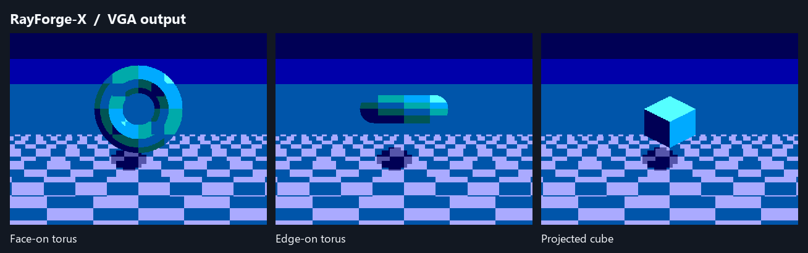

# RayForge-X

RayForge-X is a single-tile VGA graphics ASIC for Tiny Tapeout TTSKY26e. It draws a face-on or edge-on torus, or a projected cube, above a checkerboard with a moving screen-space shadow. It generates every pixel as the VGA beam advances, using one 25.175 MHz clock and no framebuffer or external memory.



## What the chip does

| Feature | Implementation |
| --- | --- |
| Video | 640×480 visible pixels, 800×525 total raster, 59.94 Hz at 25.175 MHz |
| Throughput | One sample per clock through three registered rendering stages |
| Torus | Exact integer annulus face-on and exact integer capsule edge-on, using the same 15-bit recurrence |
| Other geometry | Projected cube with three fixed face normals |
| Display | Six-bit RGB on the Tiny VGA PMOD, with lit, normal, depth-proxy and silhouette views |
| Controls | Four manual light directions or eight animated directions. Scene updates qualify during vertical blank. |
| Diagnostic | 1,024-sample pre-pad RGB visibility check with a seven-segment status and PASS output |
| Physical target | Sky130HD, 1×1 tile, 161.000 × 111.520 µm |

“Exact” applies to the two torus silhouettes at integer pixel centers. Lighting uses quantized normals and a fixed palette. The light can orbit automatically while the torus has two switch-selected poses.

## Run it

For hardware, connect a Tiny VGA PMOD, supply a 25.175 MHz clock, select the design and release reset. With all scene switches low, the first scene is the lit face-on torus. [Pinout and bring-up](docs/info.md)

For simulation, install Icarus Verilog, GNU Make and Python, then run these commands from the repository root.

```sh
python -m pip install -r test/requirements.txt
make -C test
bash test/run-rtl.sh
```

The standalone suite generates VGA frame captures under `test/sim_build/standalone/`. [Test coverage and commands](docs/verification.md)

## Repository guide

| Path | Purpose |
| --- | --- |
| [`src/`](src) | Synthesizable RTL and the single-tile physical configuration |
| [`info.yaml`](info.yaml) | Tiny Tapeout source manifest, clock, tile size and pin labels |
| [`docs/info.md`](docs/info.md) | Shuttle datasheet with hardware setup and controls |
| [`docs/architecture.md`](docs/architecture.md) | Pipeline, VGA timing, geometry arithmetic and diagnostic contract |
| [`docs/research.md`](docs/research.md) | Prior art, same-output area comparison, lighting accuracy and limitations |
| [`research/`](research) | Independent torus reference and geometry comparison RTL |
| [`test/`](test) | Cocotb, full-frame hardware simulation and fault tests |
| [`.github/workflows/`](.github/workflows) | RTL regression and Tiny Tapeout GDS, precheck, gate simulation, datasheet and viewer builds |

The pinned local physical build mapped to **11,363.3984 µm²** against the **11,500 µm²** project cap. Fabrication uses the GDS and precheck artifacts for the exact revision selected in Tiny Tapeout. [Physical evidence and scope](docs/research.md) · [GitHub Actions](https://github.com/S-SUJAN-S/tt_um_rayforge_3d/actions) · [Layout viewer](https://s-sujan-s.github.io/tt_um_rayforge_3d/)

**Authors** Sujan S, Tejasvi R Shankar, Yogesh Mahesh Bisnal, and Prathik P Kekare. [Apache 2.0 license](LICENSE)
